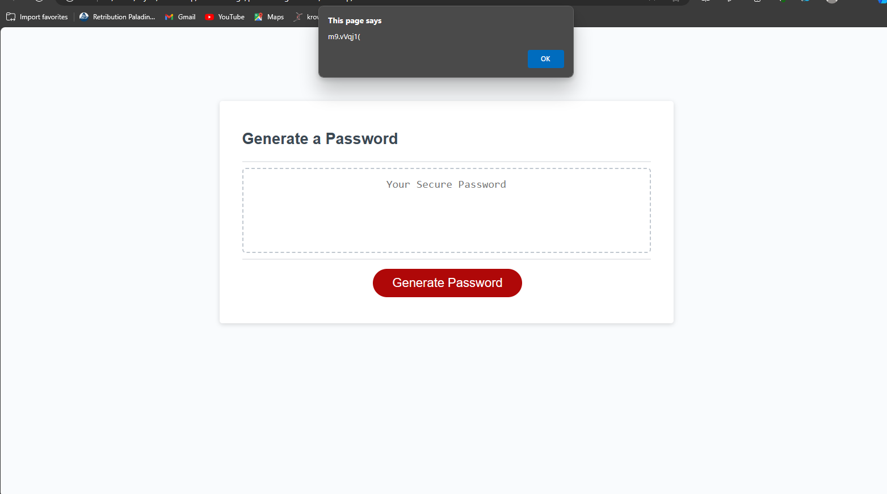

# password-generator

## Description
This project allows the user to develop a random password based on a number of criteria. These criteria are given to the user via prompts.

I expanded upon given code and researched various aspects of JavaScript to create a random password generator. I now have a better understanding of JavaScript and how to make web pages more interactive.

## Usage
Here is the live link:

